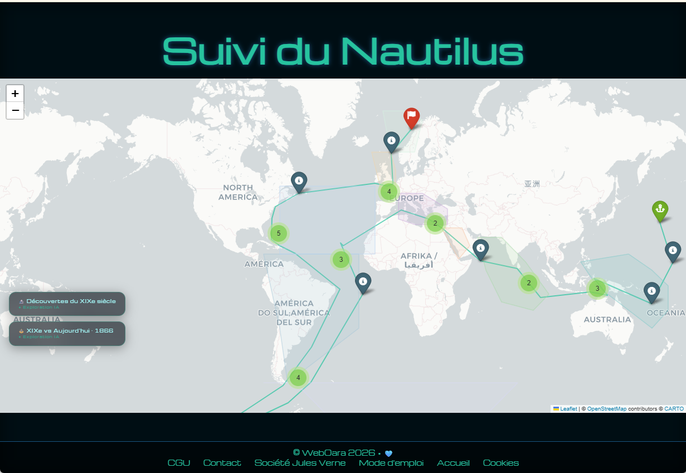

# 🦑 Exploration du Nautilus

> _« Une carte interactive immersive inspirée de Jules Verne, propulsée par de l'IA générative et du web moderne. »_



🌐 **Site en ligne :** [the-nautilus-exploration.netlify.app](https://the-nautilus-exploration.netlify.app)

---

## 🚀 Présentation

J'ai réalisé ce projet car, étant une femme très organisée, j'ai visualisé le trajet du Nautilus comme une carte mentale. Cette intuition m'a menée à extraire et structurer les données géographiques du roman _Vingt mille lieues sous les mers_ 🦑 de Jules Verne, puis à les enrichir progressivement avec de l'intelligence artificielle.

Le projet est né d'une question simple : _et si on pouvait suivre le Nautilus sur une carte interactive, avec toutes les informations scientifiques, biologiques et historiques que Jules Verne a semées dans son roman ?_

À l'aide de JupyterLab, de Python et d'un modèle de langage local (Mistral 7B via Ollama), j'ai conçu une application qui reconstitue le voyage complet du Nautilus — 32 escales, 9 zones océaniques, quatre contenus d'information par escale.

---

## 🛠️ Fonctionnalités

🌍 **Carte interactive** retraçant les 32 escales du Nautilus sur les océans du monde

🌊 **9 zones océaniques** représentées par des polygones colorés pastels transparents sur la carte

📱 **Interface responsive** adaptée aux mobiles et desktop

🎨 **Interface HUD** noir et turquoise, style immersif inspiré des sous-marins

📖 **Entrée 1 — Extrait du livre** : extraits authentiques du roman de Jules Verne extraits directement du fichier texte par ancres de recherche — zéro IA, 100 % fidèle à Jules Verne

🐟 **Entrée 2 — Espèces maritimes** : 572 espèces (528 faune + 44 flore) relevées manuellement chapitre par chapitre dans le texte original, classées en FAUNE MARITIME et FLORE MARITIME

🔬 **Exploration 1 — Découvertes du XIXe siècle** : textes générés par IA (Mistral 7B local) par zone océanique — naturalistes, expéditions réelles, espèces découvertes, cartographie et bathymétrie de l'époque

⚖️ **Exploration 2 — XIXe vs Aujourd'hui** : comparaison générée par IA entre les connaissances de 1866 et la réalité scientifique et écologique actuelle, avec mise en valeur du génie visionnaire de Jules Verne

---

## 🤖 Architecture IA

Ce projet utilise une approche hybride :

- **Extraction directe** pour les fiches du roman (extraits et espèces) — algorithme Python, ancres textuelles, zéro IA
- **Génération locale** pour les explorations scientifiques — Mistral 7B via Ollama, par zones océaniques

```
Roman .txt  →  Algorithme Python (ancres + regex)
                      ↓
              extraits_content{}  +  especes_content{}
                      ↓
              Ollama / Mistral 7B (local)
                      ↓
              decouvertes_zones.json
              comparaison_zones.json
                      ↓
              nautilus_map_v16.html  →  Netlify
```

---

## ⚙️ Installation & utilisation

### Prérequis

- Python 3.10+
- JupyterLab
- [Ollama](https://ollama.com) installé avec le modèle Mistral :

```bash
ollama pull mistral
```

### Cloner le repo

```bash
git clone https://github.com/mimiecmoua/nautilus-map.git
cd nautilus-map
```

### Installer les dépendances Python

```bash
pip install folium pandas
```

### Lancer le notebook

```bash
jupyter lab
```

Ouvrir `notebooks/Map_nautilus_v16.ipynb` et exécuter toutes les cellules (**Run All**).

> ⚠️ Ollama doit être actif (icône lama dans la barre des tâches Windows) lors de la première exécution pour générer les explorations IA. Les exécutions suivantes chargent directement les JSON sans rappeler le modèle.

### Déployer sur Netlify

Pousser les fichiers générés sur GitHub — Netlify déploie automatiquement.

---

## 🗂️ Structure du projet

```
nautilus-map/
├── notebooks/
│   ├── Map_nautilus_v16.ipynb            # Notebook principal
│   ├── Points-escales-chapitres.json     # 32 escales avec coordonnées
│   ├── especes_maritimes_livre.json      # 572 espèces relevées manuellement
│   ├── decouvertes_zones.json            # Découvertes XIXe par zone (IA)
│   ├── comparaison_zones.json            # Comparaison 1866/aujourd'hui (IA)
│   └── data_texts/
│       ├── 20000lieues_fr.txt            # Roman en français
│
├── img/                                  # Images et assets
├── nautilus_map_v16.html                 # Carte générée (déployée)
├── index.html                            # Page d'accueil
├── index2.html                           # Page carte
├── index_md.html                         # Page mode d'emploi
├── README.md                             # Ce fichier
└── style.css                             # Styles globaux
```

---

## 🛠️ Technologies utilisées

| Technologie             | Rôle                                         |
| ----------------------- | -------------------------------------------- |
| **Python 3**            | Langage principal                            |
| **JupyterLab**          | Environnement de développement               |
| **Folium**              | Cartographie interactive (Leaflet.js)        |
| **Pandas**              | Manipulation des données tabulaires          |
| **Ollama + Mistral 7B** | IA générative locale (explorations 1 & 2)    |
| **Regex + ancres**      | Extraction des extraits et espèces (entrées) |
| **HTML / CSS / JS**     | Interface HUD, animations, rendu final       |
| **Netlify**             | Déploiement statique gratuit                 |
| **GitHub**              | Versioning et intégration continue           |

---

## 📊 Chiffres clés

- 📍 **32 escales** reconstituées sur les océans du monde
- 🌊 **9 zones océaniques** avec polygones pastels interactifs
- 🐟 **572 espèces maritimes** relevées manuellement dans le texte original
- 🔬 **9 fiches découvertes XIXe** générées par Mistral par zone océanique
- ⚖️ **9 fiches comparaison** XIXe vs Aujourd'hui générées par Mistral
- 💰 **Coût de fonctionnement : 0 €** — 100 % local, 100 % open source

---

## 👩‍💻 Auteure

Ce projet a été imaginé, conçu et développé par **Émilie Clain — webOara**, consultante en stratégie digigtale (développeuse web et IA) et passionnée par l'univers de Jules Verne.

💡 Elle aime transformer des idées audacieuses en expériences interactives accessibles.  
🎨 Entre deux lignes de code, elle explore la résolution de problèmes du quotidien, la reconnaissance du travail, l'histoire… et parfois même les fonds marins.

📫 Contact pro : [LinkedIn](https://www.linkedin.com/in/emilieclain)  
💻 Code open source : [GitHub](https://github.com/mimiecmoua/nautilus-map)  
🌐 Site : [weboara.com](https://weboara.com)

---

## 🏛️ Remerciements

Projet présenté à la **Société Jules Verne** — association dédiée à la promotion et à l'étude de l'œuvre de Jules Verne.

_« La science, mon ami, est faite d'erreurs, mais d'erreurs qu'il est bon de commettre, car elles mènent peu à peu à la vérité. »_ — Jules Verne

---

© 2026 WebOara — Émilie Clain | Licence CC BY-NC-ND 4.0
