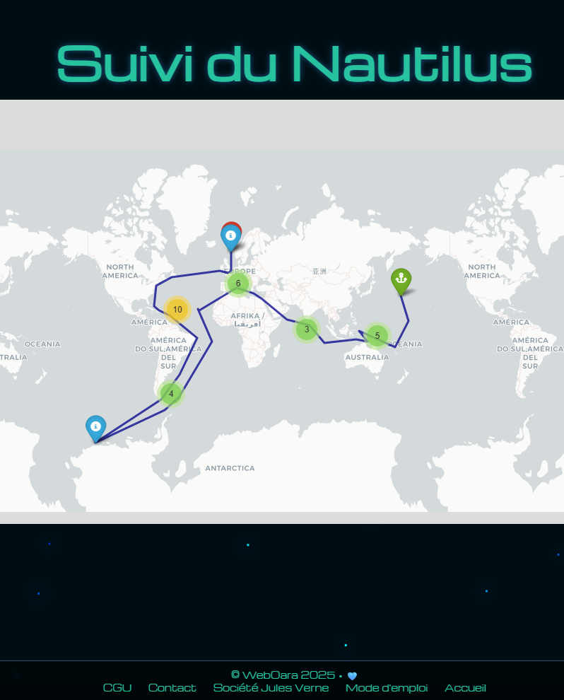

# 🦑 Atlas du Nautilus — The Nautilus Exploration

> _"An immersive interactive map inspired by Jules Verne, powered by generative AI and modern web technologies."_



🌐 **Live site:** [the-nautilus-exploration.netlify.app](https://the-nautilus-exploration.netlify.app)

---

## 🚀 Overview

I created this project because, as a highly organized person, I naturally visualized the Nautilus's journey as a mind map. This intuition led me to extract and structure the geographic data from Jules Verne's _Twenty Thousand Leagues Under the Seas_ 🦑, and progressively enrich it with artificial intelligence.

The project started with a simple question: _what if you could follow the Nautilus in real time on an interactive map, with all the scientific, biological and historical details Jules Verne wove into his novel?_

Using JupyterLab, Python, and a local language model (Mistral 7B via Ollama), I built an application that reconstructs the Nautilus's complete voyage — 32 stops, two languages, four information cards per stop, partly generated by real generative AI.

---

## 🛠️ Features

🌍 **Interactive map** retracing all 32 Nautilus stops across the world's oceans

🌊 **Ocean-inspired visual effects** with 3D immersive interface

📱 **Responsive interface** for both desktop and mobile

🇫🇷🇬🇧 **Full bilingual display** — French and English throughout

📖 **Card 1 — Living Logbook**: authentic excerpts from Jules Verne's novel for each stop

🐋 **Card 2 — Marine Species**: 329 species detected directly in the novel's text using NLP (regex + exhaustive INPN dictionary), classified by category (cetaceans, molluscs, echinoderms, algae...)

🔬 **Card 3 — 19th-Century Scientific Discoveries**: AI-generated texts (local Mistral 7B) contextualised per stop — scientists of the era, disciplines, real expeditions

⚗️ **Card 4 — 1866 vs Today**: AI-generated comparison between what Jules Verne described and the scientific and ecological reality of 2025

---

## 🤖 AI Architecture

This project uses a simplified **RAG** (Retrieval Augmented Generation) architecture:

1. Both novel texts (`20000lieues_fr.txt` and `20000lieues_an.txt`) are split into chapters
2. For each stop, the corresponding passages are extracted and provided as context to the model
3. **Mistral 7B** (via Ollama, running locally on GPU) generates the content for cards 3 and 4
4. Results are saved as static JSON files (`fiche3_science_19c.json`, `fiche4_comparaison.json`)
5. The final HTML is generated by the notebook and deployed on Netlify — **zero cost, zero external API**

```
Books .txt  →  Python Script (Map_traduction.ipynb)
                      ↓
              Ollama / Mistral 7B (local GPU)
                      ↓
              fiche3_science_19c.json
              fiche4_comparaison.json
              especes_maritimes.json
                      ↓
              carte_nautilus_multilang.html  →  Netlify
```

---

## ⚙️ Installation & Usage

### Prerequisites

- Python 3.10+
- JupyterLab
- [Ollama](https://ollama.com) installed with the Mistral model:

```bash
ollama pull mistral
```

### Clone the repository

```bash
git clone https://github.com/mimiecmoua/nautilus-map.git
cd nautilus-map
```

### Install Python dependencies

```bash
pip install folium pandas
```

### Run the notebook

```bash
jupyter lab
```

Open `notebooks/Map_traduction.ipynb` and run all cells (**Run All**).

> ⚠️ Ollama must be running (llama icon in the Windows taskbar) on first execution to generate cards 3 and 4. Subsequent runs load the existing JSON files directly without calling the model.

### Deploy to Netlify

Push the generated files to GitHub — Netlify deploys automatically.

---

## 🗂️ Project Structure

```
nautilus-map/
├── notebooks/
│   ├── Map_traduction.ipynb          # Main notebook
│   ├── especes_maritimes.json        # 329 species extracted from the novel
│   ├── fiche3_science_19c.json       # AI-generated card 3 texts
│   ├── fiche4_comparaison.json       # AI-generated card 4 texts
│   └── data_texts/
│       ├── 20000lieues_fr.txt        # Novel in French
│       └── 20000lieues_an.txt        # Novel in English
├── img/                              # Images and assets
├── carte_nautilus_multilang.html     # Generated map (deployed)
├── index.html                        # Home page
├── index2.html                       # Map page
├── index3.html                       # User guide page
├── README.md                         # French version
└── README_EN.md                      # This file
```

---

## 🛠️ Technologies Used

| Technology              | Role                                  |
| ----------------------- | ------------------------------------- |
| **Python 3**            | Main programming language             |
| **JupyterLab**          | Development environment               |
| **Folium**              | Interactive mapping (Leaflet.js)      |
| **Pandas**              | Tabular data manipulation             |
| **Ollama + Mistral 7B** | Local generative AI (cards 3 & 4)     |
| **NLP regex + INPN**    | Marine species extraction (card 2)    |
| **Bootstrap 5**         | Modal interface and responsive layout |
| **HTML / CSS / JS**     | Final map rendering                   |
| **Netlify**             | Free static deployment                |
| **GitHub**              | Version control and CI                |

---

## 📊 Key Figures

- 📍 **32 stops** reconstructed across the world's oceans
- 🐋 **329 marine species** detected in Jules Verne's original text
- 📖 **2 languages** — full French and English
- 🤖 **64 texts generated by Mistral** (32 stops × 2 languages for card 4)
- 💰 **Running cost: €0** — 100% local, 100% open source

---

## 👩‍💻 Author

This project was imagined, designed and developed by **Émilie Clain — webOara**, a self-taught AI engineer, web developer and lifelong Jules Verne enthusiast.

💡 She loves turning bold ideas into accessible interactive experiences, with a spark of tech magic.  
🎨 When not coding, she explores art, music, history… and sometimes even the ocean depths.

📫 Professional contact: [LinkedIn](https://www.linkedin.com/in/emilieclain)  
💻 Open-source code: [GitHub](https://github.com/mimiecmoua/nautilus-map)  
🌐 Website: [weboara.com](https://weboara.com)

---

## 🏛️ Acknowledgements

Project presented to the **Société Jules Verne** — an association dedicated to the promotion and study of Jules Verne's work.

_"Science, my friend, is made of mistakes — but mistakes worth making, for they lead little by little to the truth."_ — Jules Verne

---

© 2025 WebOara — Émilie Clain | MIT License
